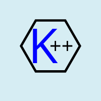

<p align="center">
  
</p>

# Kirill++

Kirill++ is a programming language that is meant for beginners. It is geared towards those who have learned programming concepts from applications like Scratch, and are ready to move to text-based programming languages. It provides a beginner friendly syntax for all levels.

## Features

- Variables in Kirill++ are declared using the keyword `STORE`, followed by the value of the variable and the keyword `IN`, followed by the variable name.
`STORE 1 IN b`


- Conditional statements in Kirill++ use the keywords `if`, `elif`, and `else`, similar to other programming languages.
```
if(1>1) STARTIF
    STORE 2 IN b
ENDIF
elif(1>2) STARTELIF
    STORE 3 IN b
ENDELIF
STARTELSE
    STORE 4 IN b
ENDELSE
```
- The `if`, `elif`, and `else` statements in Kirill++ are used to control the flow of the program based on certain conditions.
- `if` statement checks the given condition, and if the condition evaluates to true, the code block in between the `STARTIF` and `ENDI` statements is executed.
- `elif` statement checks the given condition if the previous 'if' statement and its corresponding `elif` statements conditions are false, and if the condition evaluates to true, the code block in between the `STARTELIF` and `ENDELIF` statements is executed.
- `else` statement is used as the catch-all statement, if the previous 'if' statement and all 'elif' statements conditions are false, the code block in between the `STARTELSE` and the `ENDELSE`

- The `show` function is used to print the value of a variable to the console.
show(b)

- The `show` function takes any data type, in a variable or not, and prints it to the console.

- Comments in Kirill++ are denoted by `//`. Anything following `//` is ignored by the interpreter, it is used to leave annotations or explanations in the source code.

## Getting started

Here is a basic example program that demonstrates the use of variables, conditional statements, and the `show` function:
```
// Program to test If, Else if, and Else statements
STORE 1 IN b
if(1>1) STARTIF
    STORE 2 IN b
ENDIF
elif(1>2) STARTELIF
    STORE 3 IN b
ENDELIF
STARTELSE
    STORE 4 IN b
ENDELSE
show(b)
```

This program declares a variable `b` and assigns it the value of `1`. It then uses an `if`, `elif`, and `else` statement to reassign the value of `b` based on different conditions. Finally, it uses the `show` function to print the final value of `b` to the console.